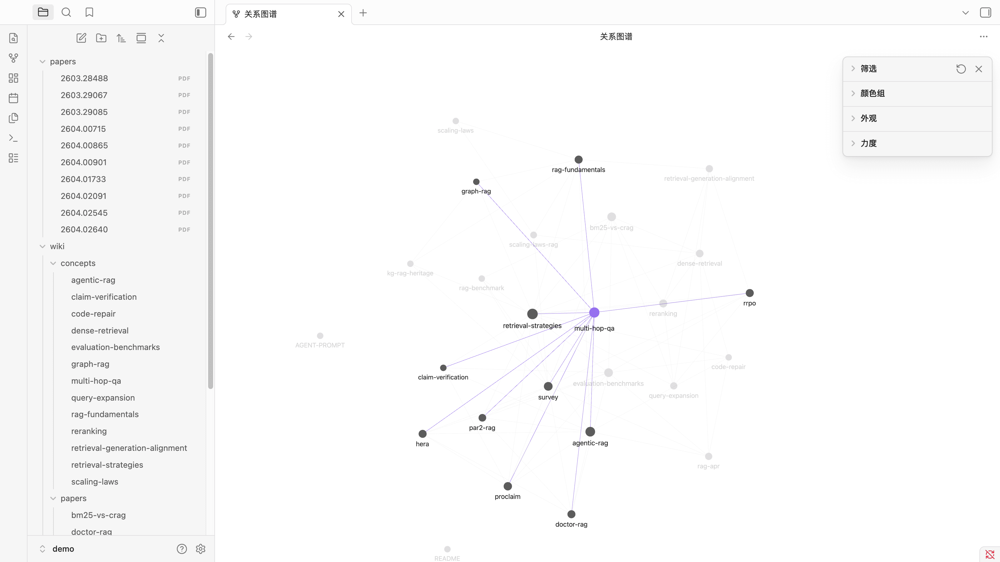
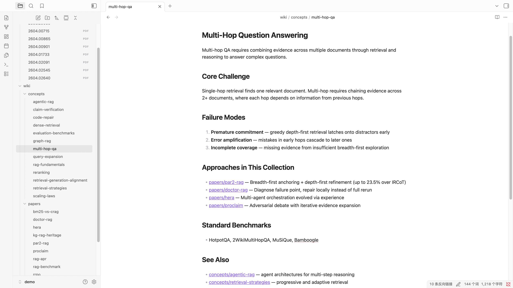
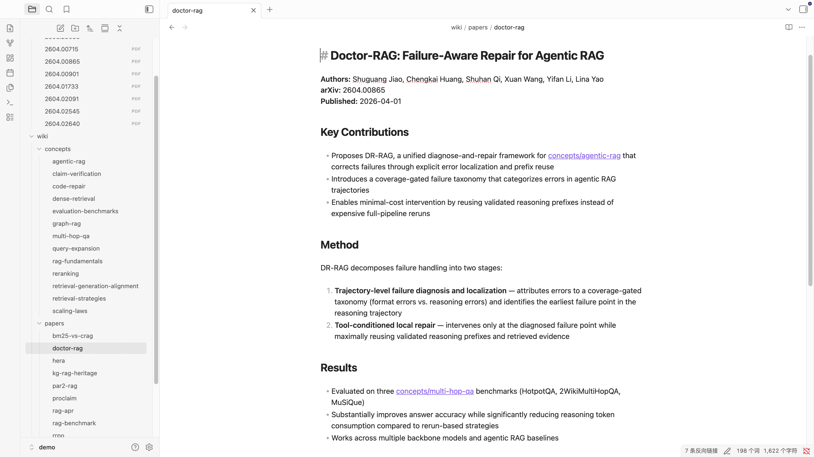

# MinerU Document Explorer Demo: Agent-Driven RAG 研究综述

本 Demo 展示 MinerU Document Explorer 作为 **Agent 基础设施** 的核心定位：
数据摄取、Wiki 构建、深度阅读、综述撰写全部由 LLM Agent 通过 MCP 工具驱
动——脚本只做最少的「非智能」工作（抓取 arXiv + 建索引）。

<p>
  <a href="README.md">English</a>
</p>

> **不确定这个项目适不适合你？** 看完这个 Demo 你会理解：MinerU Document Explorer
> 不是又一个 RAG 框架，而是让 AI Agent 真正拥有「读文档 → 搜信息 → 写知识」能力
> 的基础设施。你提供文档，Agent 自主完成其余所有工作。

---

## 这个项目解决什么问题？

传统知识库方案的痛点：

| 痛点 | 传统方案 | MinerU Document Explorer |
|:-----|:---------|:-------------------------|
| Agent 无法读 PDF/DOCX | 手动转换或全文塞进 prompt | `doc_toc` → `doc_read` 按需精读，token 高效 |
| 搜索质量差 | 纯关键词或纯向量 | BM25 + 向量 + LLM 重排序三路融合 |
| 知识碎片化 | 检索到片段后丢失上下文 | Wiki 知识编译，Agent 边读边建知识图谱 |
| 集成复杂 | 需要写大量胶水代码 | 15 个 MCP 工具，开箱即用 |
| 不可追溯 | 不知道答案出自哪里 | `source` 字段追溯来源，`wiki_lint` 检测过期 |

## 效果展示

运行本 Demo 后，Agent 会自主从 10 篇 arXiv 论文构建结构化的 Wiki 知识库：

**Wiki 知识图谱** — 概念和论文通过 `[[wikilinks]]` 互相连接，可视化为交互式关系图：



**概念页面** — 跨论文综合关键主题（如 multi-hop QA），包含相关方法和基准测试：



**论文摘要页** — 结构化的单篇论文页面，包含核心贡献、方法、实验结果和交叉引用：



---

## 典型使用场景

### 场景 1：科研文献综述

```
你：「帮我综述这 10 篇 RAG 论文的最新进展」
Agent：
  1. query("RAG retrieval augmented generation") 找到关键论文
  2. doc_toc → doc_read 精读每篇论文的摘要和方法章节
  3. doc_write 为每篇论文写 Wiki 摘要页，建立 [[wikilinks]] 交叉引用
  4. query 跨论文搜索特定主题，doc_write 撰写综述
  → 输出：结构化的 Wiki 知识库 + 完整的研究综述文档
```

### 场景 2：项目文档知识库

```
你：「索引我们的设计文档，告诉我认证模块的架构」
Agent：
  1. status 查看已索引的集合
  2. query("authentication module architecture") 搜索相关文档
  3. doc_toc 查看文档结构 → doc_read 精读架构章节
  → 输出：精确引用文档原文的架构说明
```

### 场景 3：课程学习

```
你：「帮我从这些教材里整理机器学习的核心概念」
Agent：
  1. 为每本教材 doc_toc 获取目录
  2. doc_grep("gradient descent|backpropagation") 定位关键章节
  3. doc_read 精读 → doc_write 写概念 Wiki 页
  4. wiki_index 生成知识图谱索引
  → 输出：互相链接的概念 Wiki + 自动生成的索引页
```

---

## 架构：脚本 vs Agent 的分工

```
┌────────────────────────────────────────────────────────────────┐
│  setup.sh (脚本, 无 LLM)                                       │
│  ① arXiv API → 下载 PDF                                       │
│  ② qmd collection add → 建立全文索引                            │
│  ③ qmd embed (可选) → 向量嵌入                                  │
└──────────────────────────┬─────────────────────────────────────┘
                           │ MCP 连接
                           ▼
┌────────────────────────────────────────────────────────────────┐
│  LLM Agent (由 AGENT-PROMPT.md 引导)                            │
│                                                                │
│  Phase 1: 侦察                                                 │
│    status → query("RAG") → doc_toc(top papers)                 │
│                                                                │
│  Phase 2: Wiki 构建 (循环)                                      │
│    wiki_ingest → doc_read(关键章节) → doc_write(Wiki 页面)       │
│    ↻ 对每篇论文重复，边读边建立 [[wikilinks]] 知识图谱             │
│                                                                │
│  Phase 3: 综述撰写                                              │
│    query(各研究维度) → doc_read(精读) → doc_write(survey.md)      │
│                                                                │
│  Phase 4: 质量检查                                              │
│    wiki_lint → wiki_index → 修复断链/孤页                        │
└────────────────────────────────────────────────────────────────┘
```

**关键区别**：没有 `build_wiki.py` 或 `generate_survey.py`。Wiki 页面的
内容、结构、分类、交叉引用，全部由 Agent 在理解论文内容后自主决定。

---

## 快速开始

### 前置条件

| 依赖 | 版本要求 | 安装方式 |
|:-----|:---------|:---------|
| Python | >= 3.10 (**必须**) | 系统自带或 `brew install python` |
| Bun | latest | `curl -fsSL https://bun.sh/install \| bash` |
| feedparser | latest | `pip install feedparser` |
| pymupdf | latest | `pip install pymupdf` |

```bash
# 验证依赖
python3 --version          # 需要 >= 3.10
python3 -c "import pymupdf; import feedparser; print('OK')"
bun --version

# 安装项目依赖
bun install
```

### Step 1: 运行 setup（唯一的脚本步骤）

```bash
# 使用 MinerU cloud 高质量解析（推荐）
MINERU_API_KEY=your_key bash demo/setup.sh

# 或在 ~/.config/qmd/doc-reading.json 中配置 MinerU
bash demo/setup.sh

# PyMuPDF 本地解析（快速，不需要 API Key）
bash demo/setup.sh --skip-embed

# 仅元数据不下载 PDF（最快，用于测试流程）
bash demo/setup.sh --skip-download --skip-embed
```

> **MinerU vs PyMuPDF**: MinerU 使用 VLM 模型进行 OCR 和版面分析，能正确
> 提取表格、公式、图表等复杂元素为结构化 Markdown。PyMuPDF 是纯文本提取，
> 速度快但对扫描件和复杂版面支持较弱。

### Step 2: 启动 MCP 服务器

```bash
# HTTP 模式（推荐，共享服务器，模型常驻内存）
bun src/cli/qmd.ts --index demo mcp --http

# 或 stdio 模式（适合直接嵌入 MCP 客户端配置）
bun src/cli/qmd.ts --index demo mcp
```

### Step 3: 让 Agent 工作

将 `demo/AGENT-PROMPT.md` 的内容作为 system prompt 或首条指令发送给你的
LLM Agent（需要配置 MCP 连接到上一步的服务器）。

Agent 会自主完成：
- 用 `wiki_ingest` 分析每篇论文
- 用 `doc_toc` + `doc_read` 精读关键章节
- 用 `doc_write` 写 Wiki 页面并建立 `[[wikilinks]]` 知识图谱
- 用 `query` 做跨论文检索
- 用 `doc_write` 撰写最终的 `survey.md`
- 用 `wiki_lint` + `wiki_index` 做质量检查

---

## MCP 工具详解

MinerU Document Explorer 通过 MCP 向 Agent 提供 15 个工具，分为三组。

### 🔍 检索工具（Retrieve）

在所有已索引文档中搜索信息。

| 工具 | 用途 | 示例调用 |
|------|------|----------|
| `query` | 混合搜索（BM25 + 向量 + 重排序） | `query({ query: "dense retrieval methods" })` |
| `get` | 按路径或 docid 获取完整文档 | `get({ path: "sources/2601.12345.pdf" })` |
| `multi_get` | 批量获取多个文档 | `multi_get({ pattern: "sources/*.pdf", max_lines: 50 })` |
| `status` | 查看索引健康状态和集合信息 | `status()` |

**`query` 进阶用法**：支持结构化子查询语法，可精确控制搜索方式：

```
lex:keyword search         # 仅 BM25 关键词搜索
vec:semantic meaning        # 仅向量语义搜索
hyde:hypothetical answer    # HyDE（假设性文档嵌入）
expand:brief query          # LLM 查询扩展后搜索
```

### 📖 精读工具（Deep Read）

在单个文档内部导航、搜索和提取内容——无需加载整个文件。

| 工具 | 用途 | 示例调用 |
|------|------|----------|
| `doc_toc` | 获取文档目录结构（标题/书签/幻灯片） | `doc_toc({ file: "sources/paper.pdf" })` |
| `doc_read` | 按地址精读指定章节 | `doc_read({ file: "sources/paper.pdf", addresses: ["page:3-5"] })` |
| `doc_grep` | 文档内正则搜索 | `doc_grep({ file: "sources/paper.pdf", pattern: "attention" })` |
| `doc_query` | 文档内语义搜索 | `doc_query({ file: "sources/paper.pdf", query: "model architecture" })` |
| `doc_elements` | 提取表格、图表、公式 | `doc_elements({ file: "sources/paper.pdf", types: ["table"] })` |

**`doc_read` 地址格式**：

```
page:3          # 第 3 页（PDF）
page:3-5        # 第 3-5 页
line:45-120     # 第 45-120 行（Markdown）
heading:Methods # 标题为 "Methods" 的章节
slide:5         # 第 5 张幻灯片（PPTX）
```

**典型精读流程**：
```
doc_toc(paper.pdf)              # 先看目录
  → 找到 "3. Methods" 在 page:5
doc_read(paper.pdf, "page:5-8") # 精读方法章节
doc_grep(paper.pdf, "ablation") # 搜索消融实验
  → 找到 page:12
doc_read(paper.pdf, "page:12")  # 精读实验结果
```

### 📝 知识摄取工具（Ingest）

构建和维护 LLM Wiki 知识库。

| 工具 | 用途 | 示例调用 |
|------|------|----------|
| `doc_write` | 写入 Wiki 页面（自动索引 + 日志） | `doc_write({ collection: "wiki", path: "concepts/rag.md", content: "..." })` |
| `doc_links` | 查看文档的前向/反向链接 | `doc_links({ file: "wiki/concepts/rag.md" })` |
| `wiki_ingest` | 分析源文档，准备 Wiki 摄取 | `wiki_ingest({ source: "sources/paper.pdf", wiki: "wiki" })` |
| `wiki_lint` | 健康检查（孤页、断链、过期页） | `wiki_lint()` |
| `wiki_log` | 查看 Wiki 活动时间线 | `wiki_log()` |
| `wiki_index` | 生成 Wiki 索引页 | `wiki_index({ collection: "wiki", write: true })` |

**`doc_write` 参数说明**：

| 参数 | 必须 | 说明 |
|------|:----:|------|
| `collection` | ✅ | 目标集合名（如 `"wiki"`） |
| `path` | ✅ | 集合内相对路径（如 `"papers/my-paper.md"`） |
| `content` | ✅ | Markdown 内容，可包含 `[[wikilinks]]` |
| `title` | - | 页面标题 |
| `source` | - | 来源文档路径（用于追溯和过期检测） |

**Wiki 页面推荐结构**：

```
wiki/
├── papers/                  # 论文摘要页
│   ├── attention-is-all-you-need.md
│   └── rag-survey-2026.md
├── concepts/                # 概念页（跨论文综合）
│   ├── dense-retrieval.md
│   ├── query-expansion.md
│   └── evaluation-benchmarks.md
├── survey.md                # 最终综述文档
└── index.md                 # 自动生成的索引
```

---

## 完整工作流示例

以下是 Agent 在本 Demo 中的典型工作流程，你也可以在自己的场景中参考这个模式。

### Phase 1: 侦察（~2 分钟）

```
Agent: status()
  → "2 collections: sources (10 docs), wiki (0 docs)"

Agent: query({ query: "RAG retrieval augmented generation survey" })
  → 返回排序后的论文列表，含标题、摘要片段、相关度分数

Agent: doc_toc({ file: "sources/2601.00123.pdf" })
  → 返回论文结构：Abstract, Introduction, Related Work, Methods, ...
```

### Phase 2: Wiki 构建（每篇论文 ~1 分钟）

```
Agent: wiki_ingest({ source: "sources/2601.00123.pdf", wiki: "wiki" })
  → 返回论文内容 + 已有相关 Wiki 页面 + 建议的写入路径

Agent: doc_read({ file: "sources/2601.00123.pdf", addresses: ["page:1-3"] })
  → 精读摘要和引言

Agent: doc_write({
  collection: "wiki",
  path: "papers/adaptive-rag.md",
  content: "# Adaptive RAG\n\n**Key contribution**: ...\n\n## Connections\n- Related to [[concepts/dense-retrieval]]\n- Extends [[concepts/query-expansion]]",
  source: "sources/2601.00123.pdf"
})
  → Wiki 页面已写入并自动索引，后续 query 可搜索到
```

### Phase 3: 综述撰写（~5 分钟）

```
Agent: query({ query: "dense retrieval methods comparison 2026" })
  → 搜索所有文档（包括已写入的 Wiki 页面）

Agent: doc_read(top_result, "page:5-8")
  → 精读关键方法章节

Agent: doc_write({
  collection: "wiki",
  path: "survey.md",
  content: "# RAG Research Survey: 2026 Frontiers\n\n## 1. Introduction\n..."
})
```

### Phase 4: 质量检查（~1 分钟）

```
Agent: wiki_lint()
  → "2 broken links: [[concepts/graph-rag]], [[concepts/multi-hop-qa]]"
  → Agent 自动创建缺失的概念页

Agent: wiki_index({ collection: "wiki", write: true })
  → 生成 index.md，列出所有 Wiki 页面和链接关系
```

---

## 自定义你的 Demo

### 更换数据源

本 Demo 使用 arXiv RAG 论文，但你可以替换为任何文档：

```bash
# 索引本地 PDF 文件夹
qmd collection add ~/my-papers --name sources --mask '**/*.pdf'

# 索引 Markdown 笔记
qmd collection add ~/notes --name notes --mask '**/*.md'

# 索引混合格式
qmd collection add ~/docs --name docs --mask '**/*.{md,pdf,docx,pptx}'

# 创建 Wiki 集合
mkdir -p ~/my-wiki
qmd collection add ~/my-wiki --name wiki --type wiki
```

### 调整 Agent Prompt

编辑 `demo/AGENT-PROMPT.md` 以适应你的场景：
- 修改集合名称和路径
- 调整 Wiki 页面的目录结构
- 修改综述文档的大纲
- 增减 Agent 需要执行的阶段

### MCP 客户端配置

**Cursor**（HTTP 模式）：

```json
{
  "mcpServers": {
    "qmd": {
      "url": "http://localhost:8181/mcp"
    }
  }
}
```

**Claude Code**（stdio 模式）：

```bash
claude mcp add qmd -- bun src/cli/qmd.ts --index demo mcp
```

**Claude Desktop**（stdio 模式）：

```json
{
  "mcpServers": {
    "qmd": {
      "command": "qmd",
      "args": ["--index", "demo", "mcp"]
    }
  }
}
```

---

## 为什么这样设计？

传统做法会写一个 `build_wiki.py`，用模板和启发式规则把论文"变换"成 Wiki
页面。但这忽略了 RAG 系统的核心价值：

1. **理解 > 变换**：Agent 读懂论文后决定 Wiki 结构，而不是按固定模板填充
2. **增量知识**：每写一个 Wiki 页面都会被索引，后续检索自动受益
3. **交叉引用**：Agent 发现论文间的联系后用 `[[wikilinks]]` 连接，形成知识图谱
4. **可追溯**：`doc_write(source=...)` 记录 Wiki 页面的来源，`wiki_lint` 检测过期
5. **可复现**：同样的 prompt + 同样的索引 = 确定性的 Agent 行为

这正是 [LLM Wiki Pattern](https://karpathy.ai/) 的实践：索引和搜索是基础设施，
知识合成是 Agent 的工作。

---

## 常见问题

### Q: 只有 Markdown 文档能用吗？

不是。MinerU Document Explorer 支持 Markdown、PDF、DOCX、PPTX 四种格式。PDF 解析
支持 PyMuPDF（本地快速提取）和 MinerU Cloud（高质量 VLM 解析），后者对扫描件、
复杂表格、公式的支持显著优于纯文本提取。

### Q: 必须用 MCP 吗？能直接 CLI 使用吗？

可以纯 CLI 使用。所有 MCP 工具都有对应的 CLI 命令（如 `qmd query`、`qmd doc-toc`、
`qmd doc-read`）。但 MCP 服务器模式下模型常驻内存，响应速度快 5-15 秒，推荐在
Agent 工作流中使用。

### Q: 向量嵌入是必须的吗？

不是。`qmd search` 使用纯 BM25 关键词搜索，零配置即可使用。向量嵌入（`qmd embed`）
是可选的，启用后 `qmd query` 会使用 BM25 + 向量 + LLM 重排序的三路融合搜索，
效果更好但需要下载约 2GB 的模型。

### Q: 支持哪些 AI Agent？

任何支持 MCP 协议的 Agent 都可以使用，包括 Claude Desktop、Claude Code、Cursor、
Windsurf、VS Code + Copilot 等。也可以通过 SDK 直接集成到自定义 Agent 中。

---

## 清理

```bash
# 删除索引数据库
rm -f ~/.cache/qmd/demo.sqlite

# 删除下载的论文 PDF
rm -rf demo/papers

# 如果需要完全重置 wiki（会删除已提交的示例 wiki 页面）
# rm -rf demo/wiki
```

> **注意**: `demo/wiki/` 包含预置的示例 Wiki 页面（概念和论文摘要），可作为
> Agent 构建 Wiki 的参考起点。删除前请确认你不需要这些内容。
